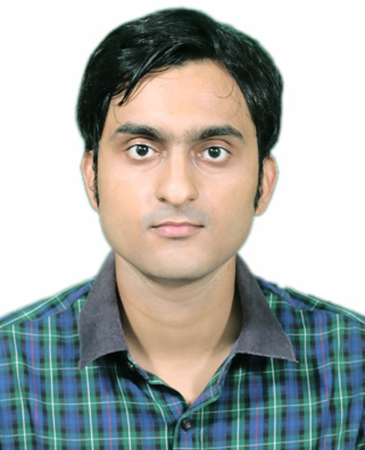

  <figure>
  
</figure>

 
I am currently a Postdoctoral fellow in the [Division of Imaging, Diagnostics, and Software Reliability](https://www.fda.gov/about-fda/cdrh-offices/division-imaging-diagnostics-and-software-reliability) at US Food and Drug Administration. Before joining FDA, I graduated from Michigan State University with a PhD. degree in Electrical and Computer Engineering. I was advised by Professor Yiming Deng & Professor Lalita Udpa at Non Destructive Evaluation Laboratory, [NDEL](https://www.egr.msu.edu/ndel/). On the algorithmic side, I develop novel statistical learning based signal and image processing algorithms, Artificial Intelligence (AI)- Machine Learning (ML) algorithms for medical and NDE imaging. I am also interested in data fusion, volumetric registration, survival analysis, joint modelling and in developing different sub sampling and sparsifying algorithms. On the hardware side, I focus on design and development of different physics based sensors and systems for monitoring and evaluating structural integrity of parts and components. The indexing of all my published paperscan be accessed from my <a href='https://submukherjee.github.io/Research/'>Research</a> page. You can find my [Resume](https://drive.google.com/file/d/1m8ziY8zjwzffIgmvwjeNoa7SHM95LKVH/view?usp=sharing) here. 

----------
<a name="Education">Education</a>
 * Phd in Electrical & Computer Engineering (2018-2023), [Michigan State University](https://msu.edu/): CGPA **3.83/4**. 
 * B.Tech in Electronics & Communication Engineering (2011-2015), [National Institute of Technology, Durgapur](http://www.nitdgp.ac.in/): CGPA **8.46/10**.
 
Below is a list of topics that I am currently working.

**Methodological & Algorithmic Development**
* Medical Imaging Analysis
  * Volumetric Image registration and correspondence in longitudinal medical data
  * AI based survival modelling
  * Deep Learning assisted lesion and organ segmentations 
* Robust Data Analysis for NDE
  * Spatially Adaptive Denoising based model
  * kriging based sub-sampling schemes for fast detection
  * Transfer learning aided Mixture Regression & Wavelet based denoising
* AI enabled NDE systems
  * Deep Learning in Laser Profilometry
  * Material Characterization in NDE using ML and registration
  * Different Damage Classifications
* Miscellaneous
  * Data fusion from different sensing technqiues
  * Compressed sensing & Time Reversal framework for limited data in Thermoacoustic tomography

**Hardware setup & Sensor Development**
* Magnetic flux leakage (MFL) sensor
* Laser Profilometry
* Capacitive & Eddy Current sensor
* Finite Element Modelling

----------
<a name="Research Interest">Research Interests</a>

Algorithm Development, Non-destructive Evaluation, Medical Imaging, Data Analysis, Statistical Inference, Signal and Image processing, Artificial Intelligence, Machine Learning, Computer Vision

**Contact:**
10903 New Hampshire Ave, Silver Spring, MD 20993.
Email: subrata.mukherjee@fda.hhs.gov, mukher52@msu.edu

